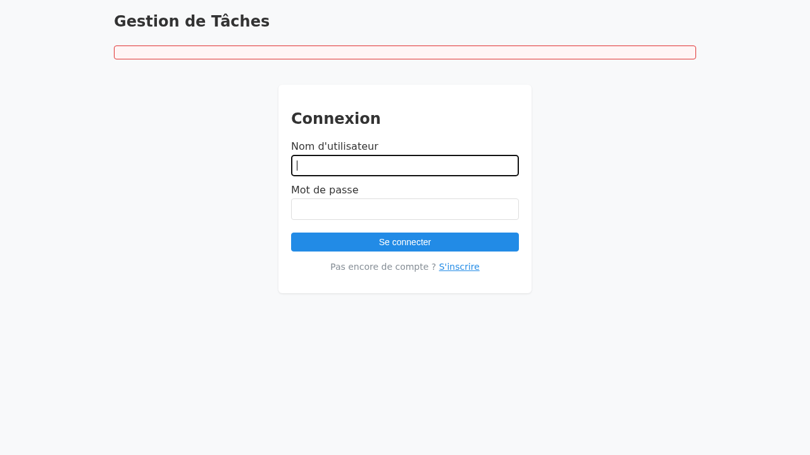
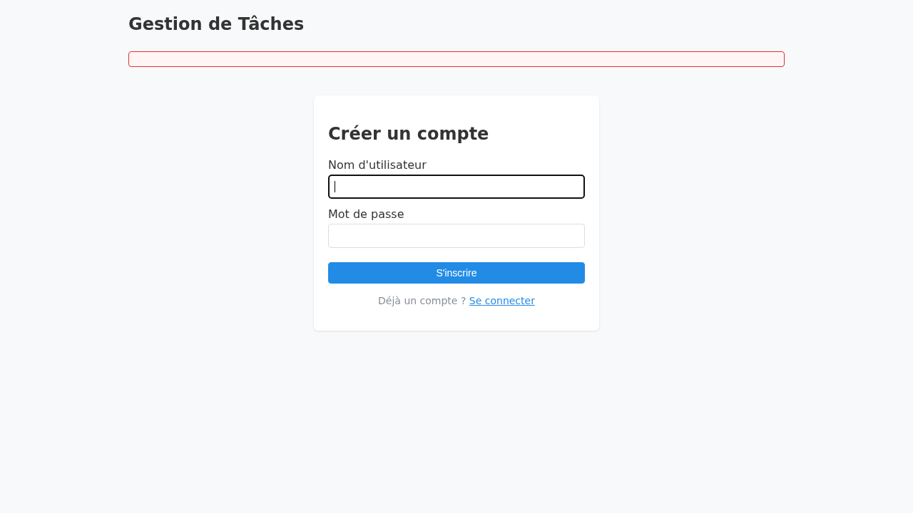
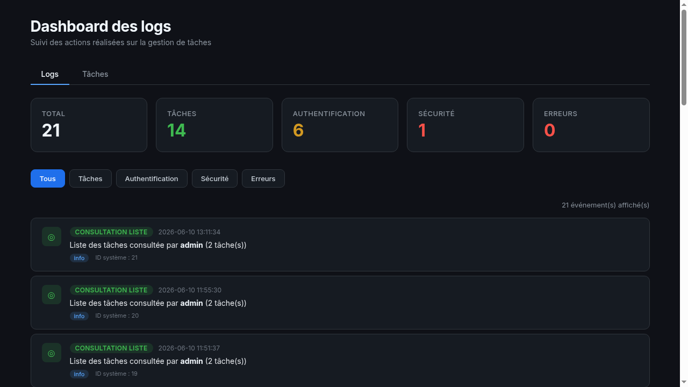
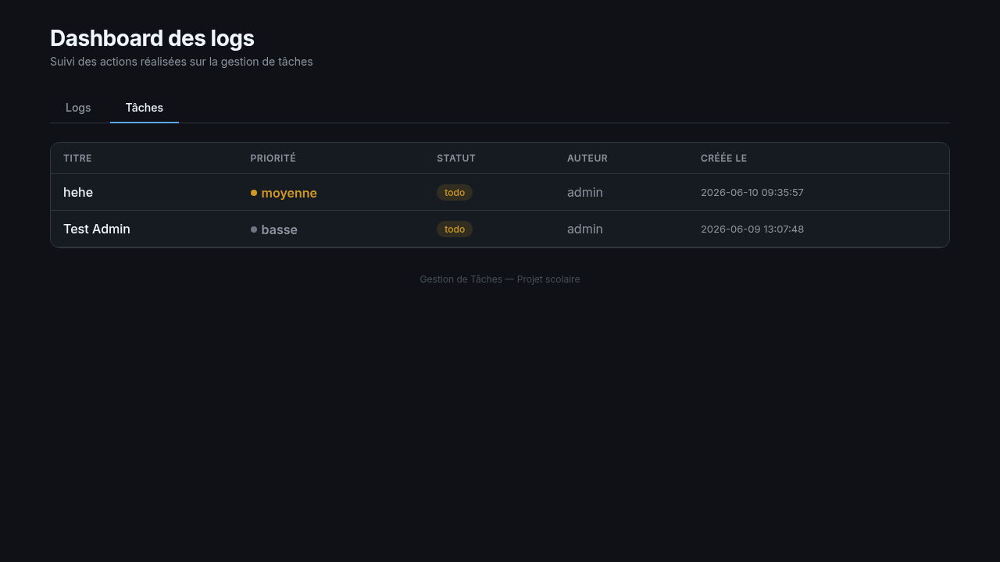

# Gestion de Tâches — TaskLogger

Projet scolaire — Application de gestion de tâches avec journalisation syslog centralisée.

## Architecture

4 conteneurs Docker :

```
┌──────────┐
│   web    │ ───┐
│ PHP 8.2  │    │ UDP 514
│ TaskLogr │    │
└──────────┘    ▼
           ┌──────────┐     ┌─────────┐
           │ rsyslog  │ ──► │  mysql  │
           │ ommysql  │     │         │
           └──────────┘     │  tasks  │
                            │SystemEv.│
           ┌──────────┐     └─────────┘
           │dashboard │        ▲
           │ PHP 8.2  │────────┘
           └──────────┘    PDO
```

- **web** : PHP 8.2 — interface de gestion des tâches (port 8081)
- **dashboard** : PHP 8.2 — visualisation des logs (port 8080)
- **rsyslog** : rsyslogd avec module `ommysql` — collecte les logs UDP et les insère en MySQL
- **mysql** : MySQL 8 — stocke les tâches (`tasks`) et les logs (`SystemEvents`)

---

## Prérequis

| Logiciel | Version minimale |
|----------|:----------------:|
| Docker | 24.0+ |
| Docker Compose | 2.20+ |
| Git | 2.30+ |

Vérifier :
```bash
docker --version
docker compose version
```

---

## Installation

```bash
# 1. Cloner le dépôt
git clone https://github.com/Badr42000/GestionTaches-Logs.git
cd GestionDeTâches

# 2. Lancer l'infrastructure
docker compose up -d

# 3. Vérifier que tous les conteneurs sont opérationnels
docker compose ps

# 4. Ouvrir l'application
#    GestionDeTâches : http://[2a03:5840:111:1024:df:2cff:fe9a:36c]:8081
#    Dashboard logs  : http://[2a03:5840:111:1024:df:2cff:fe9a:36c]:8080
```

### Première connexion

| Identifiant | Mot de passe |
|-------------|:------------:|
| `admin` | `admin` |

1. Ouvrir http://[2a03:5840:111:1024:df:2cff:fe9a:36c]:8081
2. Cliquer sur **Se connecter**
3. Saisir `admin` / `admin`
4. Vous êtes connecté — la liste des tâches s'affiche

### Arrêt

```bash
docker compose down
```

Pour supprimer les données (volume MySQL) :
```bash
docker compose down -v
```

---

## Guide utilisateur

### Gestion des tâches (port 8081)

#### Créer un compte
1. Ouvrir http://[2a03:5840:111:1024:df:2cff:fe9a:36c]:8081
2. Cliquer sur **S'inscrire**
3. Saisir un nom d'utilisateur et un mot de passe (min. 4 caractères)
4. Cliquer sur **S'inscrire** — connexion automatique

#### Créer une tâche
1. Cliquer sur **+ Nouvelle tâche**
2. Remplir le titre (obligatoire), la description (optionnelle), la priorité
3. Cliquer sur **Enregistrer**
4. La tâche apparaît dans la liste

#### Modifier une tâche
1. Cliquer sur **Modifier** à côté de la tâche
2. Modifier les champs souhaités
3. Cliquer sur **Enregistrer**

#### Changer le statut
- Utiliser le menu déroulant dans la colonne **Actions**
- Statuts disponibles : `Todo` → `In progress` → `Done`

#### Supprimer une tâche
1. Cliquer sur **Supprimer**
2. Confirmer la suppression

### Dashboard de supervision (port 8080)

#### Consulter les logs
1. Ouvrir http://[2a03:5840:111:1024:df:2cff:fe9a:36c]:8080
2. Les logs s'affichent par ordre chronologique inverse
3. Utiliser les filtres par catégorie : Tâches, Authentification, Sécurité, Erreurs

#### Statistiques
- Les cartes en haut du dashboard affichent le nombre d'événements par catégorie
- Le total et le détail par type d'action sont visibles

---

## Captures d'écran


*Page de connexion (`/login`)*


*Page d'inscription (`/register`)*


*Liste des tâches — tableau avec priorités et statuts*


*Formulaire de création d'une tâche*


*Dashboard — logs avec filtres et statistiques*


*Dashboard — vue des tâches*

---

## Fonctionnalités

- Créer une tâche (titre, description, priorité)
- Changer le statut (todo → in_progress → done)
- Modifier une tâche
- Supprimer une tâche
- Journalisation de chaque action dans MySQL via syslog

## Événements journalisés

| Action | Niveau | Message (JSON dans `Message`) |
|:------:|:------:|------|
| Création | INFO | `{"action":"TASK_CREATED","id":1,"title":"...","priority":"...","status":"todo"}` |
| Modification | INFO | `{"action":"TASK_UPDATED","id":1,"field":"title","title":"...","priority":"..."}` |
| Changement statut | INFO | `{"action":"TASK_STATUS_CHANGED","id":1,"old_value":"todo","new_value":"done"}` |
| Suppression | INFO | `{"action":"TASK_DELETED","id":1,"title":"..."}` |
| Connexion réussie | INFO | `{"action":"AUTH_LOGIN_SUCCESS","username":"...","ip":"..."}` |
| Connexion échouée | WARNING | `{"action":"AUTH_LOGIN_FAILED","reason":"...","username":"...","ip":"..."}` |

---

## Structure du projet

```
GestionDeTâches/
├── docker-compose.yml
├── Makefile
├── docker/
│   ├── web/Dockerfile
│   ├── dashboard/Dockerfile
│   └── rsyslog/
│       ├── Dockerfile
│       └── rsyslog.conf
├── sql/init.sql
├── app/
│   ├── public/ (index.php, router.php)
│   ├── src/ (BaseController, Database, Logger, AuthController, TaskController, Task, User)
│   └── templates/ (layout, list, form, login, register)
├── dashboard/
│   ├── public/ (index.php, router.php)
│   ├── src/ (Database, DashboardController)
│   └── templates/ (layout, logs, tasks)
├── tests/
│   └── Unit/ (SyslogLoggerTest, TaskModelTest, UserModelTest)
├── docs/
│   ├── analyse_anssi.md
│   ├── projet_presentation.md
│   ├── presentation_slides.md
│   ├── evaluation_cpi25.md
│   └── diagrams/
│       ├── use_case.puml
│       └── deployment.puml
├── tools/
│   └── cpi_eval.py
└── README.md
```

---

## Ports

| Service | Port hôte | Port conteneur |
|---------|:---------:|:--------------:|
| TaskLogger | `8081` | 8080 |
| Dashboard | `8080` | 8080 |
| Rsyslog (UDP) | `514` | 514 |
| MySQL | `3306` | 3306 |

---

## Commandes utiles

```bash
# Démarrer en mode dev (avec reconstruction)
make dev

# Voir les logs d'un service
docker compose logs web
docker compose logs dashboard
docker compose logs rsyslog

# Inspection MySQL
docker compose exec mysql mysql -u tasklogger -ptasklogger tasklogger \
  -e "SELECT ID, ReceivedAt, Message FROM SystemEvents ORDER BY ID DESC LIMIT 10"

# Recréer un conteneur
docker compose stop <service>
docker compose rm -f <service>
docker compose up -d <service>
```

---


## Développement

```bash
# Lancer les tests unitaires
make test

# Analyser le code avec PHPStan
make phpstan
```

---

## Dashboard

Le Dashboard lit la table `SystemEvents` et affiche les logs avec :
- Statistiques en temps réel (total, créations, modifications, suppressions)
- Filtres par type d'action
- Messages humanisés à partir du JSON
- Code couleur par sévérité (info, warning, erreur)
- Design dark mode

Accessible sur [http://[2a03:5840:111:1024:df:2cff:fe9a:36c]:8080](http://[2a03:5840:111:1024:df:2cff:fe9a:36c]:8080).

---

## Documentation

| Document | Description |
|----------|-------------|
| `docs/analyse_anssi.md` | Analyse des 15 recommandations ANSSI sur la journalisation |
| `docs/projet_presentation.md` | Présentation complète du projet (contexte, objectifs, UML, schémas, mockups, tests) |
| `docs/presentation_slides.md` | Diaporama Marp pour la soutenance |
| `docs/evaluation_cpi25.md` | Rapport d'évaluation selon la grille CPI25 |
